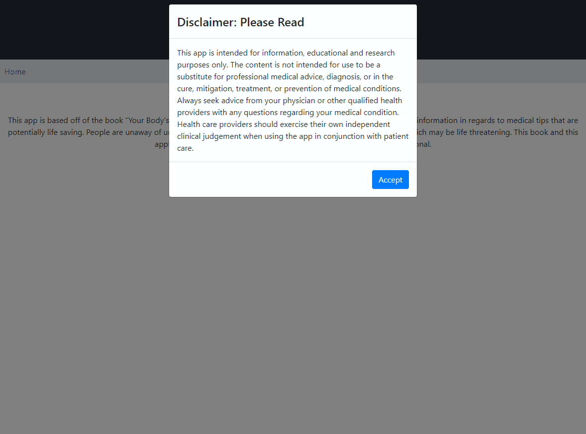

# Red Light Signals [Version 0.1.0]

## Release Notes
### Features
* Viewing and navigating through the book (Chapters, sections, tips, extra tip information, and disclaimers)
* Searching tips
* Signup/Login enforced security for modifying book data
* Adding, updating, deleting chapters, sections, tips and extra tip information

### Bugs/Defects
* There are errors in the database where some text is not formatted properly which results in illegible symbols.
* Images are not yet included in this app although some texts and descriptions do reference images.

---

## Setup

### Pre-requisites
* A command line interface
* An updated version of NodeJS https://nodejs.org/en/
* Dependencies from better-sqlite3: The dependencies may differ depending on operating system [https://github.com/JoshuaWise/better-sqlite3/blob/dc25a8e5d918206cbb5377831a528fdd420124bf/docs/troubleshooting.md]

### Dependencies
* The dependencies listed here can be installed by following the download and installation guide below this section. This section is used to list dependencies.
* nodemon [https://www.npmjs.com/package/nodemon]
* react-router [https://www.npmjs.com/package/react-router]
* concurrently [https://www.npmjs.com/package/concurrently]
* axios [https://www.npmjs.com/package/axios]
* react [https://www.npmjs.com/package/react]
* react-bootstrap [https://www.npmjs.com/package/react-bootstrap]
* react-dom [https://www.npmjs.com/package/react-dom]
* react-router-dom [https://www.npmjs.com/package/react-router-dom]
* react-scripts [https://www.npmjs.com/package/react-scripts]
* bcrypt [https://www.npmjs.com/package/bcrypt]
* sqlite3 [https://www.npmjs.com/package/sqlite3]
* better-sqlite3 [https://www.npmjs.com/package/better-sqlite3]
* body-parser [https://www.npmjs.com/package/body-parser]
* cookie-parser [https://www.npmjs.com/package/cookie-parser]
* cors [https://www.npmjs.com/package/cors]
* dotenv [https://www.npmjs.com/package/dotenv]
* express [https://www.npmjs.com/package/express]
* jsonwebtoken [https://www.npmjs.com/package/jsonwebtoken]

### Downloading and Installing Dependencies
* To install all required node packages for this project run these two commands in the project root directory:
  "npm i"
  "npm run inst"

### Building and Running the App
* To run both the server and the client concurrently:
 "npm run dev"
* To run just the client or the server:
 "npm run client" or "npm run server"

### Troubleshooting
* Problems with the app usually occur with missing dependencies. The dependencies are all listed in `package.json` in the main directories, the `/red-light-client/` directory and the `/red-light-server/` directory. 
* Once the dependencies are installed, other problems could also be missing pre-requisites such as nodejs or missing dependencies for better-sqlite3. The link is provided above to troubleshoot through missing dependencies for better-sqlite3.

---
## Directory Structure
This project is broken up into 2 projects, the client and the server side. The projects reside in the red-light-client and red-light-server directories. 
The red-light-server directory will also hold the sqlite database, database sripts, and all other server side necessities. 
The red-light-client directory will hold all the front end necessities including images, components, etc.

## Server Directory Structure
> red-light-server
>  \- \db\ -- this is is where the database and sql scripts will live. We also included the base data from the book in the \db\data\ directory in case the database needs to be reverted to the original state
>  \- \api.js  -- this is where the api calls are going to live
>  \- \middleware\ -- this is the middleware for tokenization, authentication, and verification is stored for the application
>  \- \routes\ -- these are where the api methods are for specific routes. i.e. the routes for tips will be in \routes\tips.js

### Client Directory Structure
> red-light-client
>  \- \public\ -- images,manifest,etc will live here
>  \- \src\ -- javascript/react code will live here
>  \- - \components\ -- this is where our new components for the project will be added, for example we add 'disclaimermodal.js' here

* Example API calls can be found in red-light-book\API Examples\Jr Design Example APIs.postman_collection.json. They can be referenced easily with programs like Postman
---
## Demo
